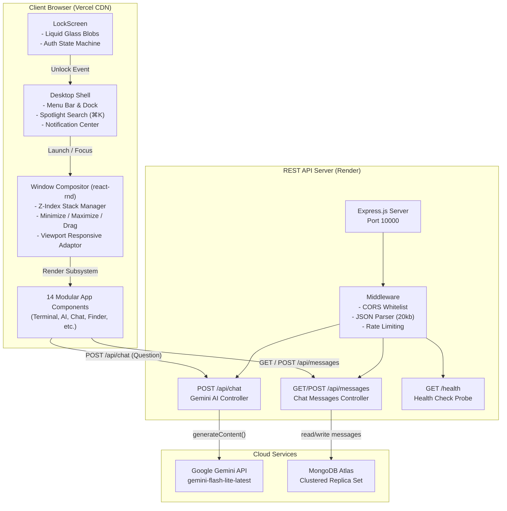
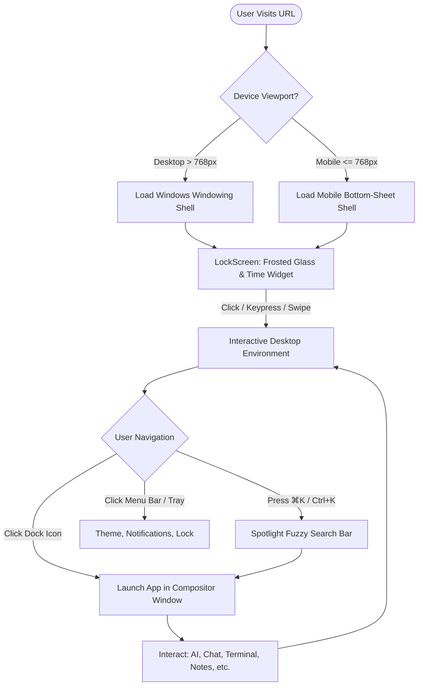

<div align="center">

# 🖥️ Kaalyug OS

**The Next-Generation Web Desktop Environment & Operating System Simulation**

*An interactive, responsive, desktop-grade operating system running natively inside modern web browsers.*

[](https://react.dev)
[](https://vite.dev)
[](https://nodejs.org)
[](https://expressjs.com)
[](https://mongodb.com)
[](https://ai.google.dev)
[](LICENSE)
[](https://vercel.com)

[Explore Features](#-system-applications) • [Architecture](#-system-architecture) • [Quickstart](#-local-development) • [API Specs](#-backend-api-reference) • [Keyboard Shortcuts](#-keyboard-shortcuts)

</div>

---

## 🌟 Overview

**Kaalyug OS** is an interactive, browser-based operating system designed to blur the boundary between web applications and desktop computing. Powered by **React 19**, **Vite**, **Express**, **MongoDB Atlas**, and **Google Gemini AI**, Kaalyug OS delivers a window compositor, a POSIX-compliant terminal shell, a virtual file system, native productivity applications, and an integrated AI intelligence core.

Whether accessed from a 4K desktop monitor or an iPhone touchscreen, Kaalyug OS dynamically morphs its interface to offer the optimal experience: a multi-window web desktop with Windows window controls and a frosted dock on large displays, and a gesture-driven mobile interface on phones.

---

## 📸 Dual-Interface Design: Desktop & Mobile

Kaalyug OS detects screen geometry and touch capabilities in real time, seamlessly adapting the interaction model:

| Interface Metric | 🖥️ Desktop Web View (> 768px) | 📱 Mobile Experience (<= 768px) |
|---|---|---|
| **Window Compositor** | Floating, draggable, resizable `react-rnd` windows | Full-viewport bottom sheets with drag handles |
| **Window Controls** | Windows-style controls (Minimize, Maximize/Restore, Close) | Top grab handle + touch dismiss |
| **App Navigation** | Glassmorphic floating dock with hover magnification | Bottom quick-dock & swipeable app grid |
| **System Bar** | Top system menu bar with live clock, battery, Wi-Fi | Consolidated mobile status header |
| **Quick Launcher** | Quick search bar triggered by `⌘K` or `Ctrl+K` | Fullscreen quick-search drawer |
| **Lock Screen** | Frosted glass liquid blobs + click-to-unlock | Touch-friendly glass unlock slider & tap prompt |

---

## 🚀 System Applications

Kaalyug OS ships with a suite of 14 integrated applications, built as modular components:

```
frontend/src/components/apps/
├── AiApp.jsx               → 🤖 Yug AI (Gemini AI Core)
├── CommunityChatApp.jsx    → 💬 Global Community Chat
├── TerminalApp.jsx         → 💻 POSIX Terminal Shell
├── FileManagerApp.jsx      → 📁 Files & Storage (Finder)
├── NotesApp.jsx            → 📝 Notes & Markdown Scratchpad
├── CalculatorApp.jsx       → 🧮 Interactive Desktop Calculator
├── BrowserApp.jsx          → 🌐 Sandboxed Web Browser
├── ActivityMonitorApp.jsx  → 📈 Live CPU & Process Activity Monitor
├── SettingsApp.jsx         → ⚙️ System Themes & Preferences
├── SnakeApp.jsx            → 🎮 Retro Arcade Canvas Game
├── AccountsApp.jsx         → 👤 User Profile & Accounts Manager
├── SystemInfoApp.jsx       → 📊 Telemetry, Specs & GitHub Stats
├── ApplicationsApp.jsx     → 🚀 System Launchpad & App Grid
└── SupportApp.jsx          → 🛟 Help Center & System Docs
```

### 1. 🤖 Yug AI (`AiApp.jsx`)
- Powered by Google Gemini (`gemini-flash-lite-latest`) through a backend proxy.
- Injected with full OS context (`context.txt`), allowing it to answer queries about system architecture, shortcuts, and troubleshooting.
- Features resilient retry logic for handling API backoff and transient network errors.

### 2. 💬 Community Chat (`CommunityChatApp.jsx`)
- Real-time global messaging space connecting all active Kaalyug OS visitors.
- Backed by MongoDB Atlas with indexed timestamps and automatic 100-message history retrieval.
- Lightweight optimistic UI updates for instant feedback.

### 3. 💻 POSIX Terminal Shell (`TerminalApp.jsx`)
- Interactive CLI emulator with ANSI styling and history navigation (Up/Down arrow keys).
- Built-in commands:
  - `help` — List all available terminal commands
  - `neofetch` — Display Kaalyug OS system specs with colored ASCII art
  - `matrix` — Trigger matrix digital rain animation
  - `clear` — Clear the terminal buffer
  - `whoami` — Print current user and session privilege
  - `date` — Print current system timestamp
  - `echo <text>` — Echo string to standard output
  - `theme <dark|blue>` — Change the desktop theme via command line
  - `open <app_id>` — Launch any GUI application from the shell
  - `calc <expr>` — Quick arithmetic evaluator
  - `sysinfo` — Display system telemetry
  - `sudo` — Easter egg permission escalation attempt

### 4. 📁 Files & Storage (`FileManagerApp.jsx`)
- Virtual File System (VFS) with folder hierarchy, file metadata, and document previewers.
- Preloaded with system documentation, project specs, and sample media.

### 5. 📝 Notes (`NotesApp.jsx`)
- Real-time scratchpad with instant `localStorage` persistence.
- Multi-note creation, editing, timestamps, and note deletion.

### 6. 🧮 Calculator (`CalculatorApp.jsx`)
- Desktop arithmetic calculator with standard operations, decimal handling, and key-press bindings.
- Responsive button grid designed for both mouse clicks and touch taps.

### 7. 🌐 Web Browser (`BrowserApp.jsx`)
- Sandboxed web browser with an address bar, reload action, bookmarks, and iframe frame rendering.
- Intelligent fallback prompting direct browser tabs for sites enforcing iframe framing restrictions (`X-Frame-Options`).

### 8. 📈 Activity Monitor (`ActivityMonitorApp.jsx`)
- Real-time visualization of simulated CPU utilization, RAM consumption, and thread count.
- Dynamic SVG graph updating every second and interactive process list.

### 9. ⚙️ Settings (`SettingsApp.jsx`)
- Live theme switching between:
  - **Dark / Midnight** (default sleek glassmorphism)
  - **Midnight Dark** (deep AMOLED black with crisp contrast)
  - **Cyberpunk Cobalt** (deep neon blue accents)
- Wallpaper selector and sound toggle preferences saved directly to `localStorage`.

### 10. 🎮 Retro Snake (`SnakeApp.jsx`)
- Pure HTML5 2D canvas game engine with variable speed, collision detection, and score tracking.
- Dual control schemes: Arrow keys / WASD on desktop, and an on-screen directional pad on mobile.

---

## 🏗️ System Architecture

Kaalyug OS employs a decoupled client-server architecture with specialized cloud services:



---

## 🔄 User Journey & Navigation Flow



---

## ⌨️ Keyboard Shortcuts

| Shortcut | Scope | Description |
|---|---|---|
| `⌘K` or `Ctrl + K` | Global | Toggle Spotlight Search quick launcher |
| `⌘L` or `Ctrl + L` | Global | Instantly lock Kaalyug OS screen |
| `Escape` | Global | Close Spotlight search, notifications tray, or active modal |
| `Enter` | Lock Screen | Unlock and transition directly to Desktop |
| `Up / Down Arrow` | Terminal | Browse terminal command history |
| `Tab` | Terminal | Auto-complete common commands |
| `Arrow Keys / WASD` | Snake Game | Control snake movement direction |

---

## 🚀 Local Development

### Prerequisites
- **Node.js** 18.x or higher
- **npm** 9.x or higher
- **MongoDB Atlas** database cluster (free M0 tier works great)
- **Google Gemini API Key** — [Get your free key here](https://aistudio.google.com/apikey)

---

### 1. Clone the Repository

```bash
git clone https://github.com/drj7zz/giridirghraj.git kaalyug-os
cd kaalyug-os
```

---

### 2. Configure & Run Backend

```bash
cd backend
npm install

# Configure environment variables
cp .env.example .env
```

Edit `backend/.env` with your credentials:
```env
PORT=10000
MONGODB_URI=mongodb+srv://<username>:<password>@cluster.mongodb.net/?retryWrites=true&w=majority
MONGODB_DB=kaalyug
FRONTEND_ORIGIN=http://localhost:5173
GEMINI_API_KEY=your_gemini_api_key_here
```

Start the backend server:
```bash
npm run dev
# Server will start on http://localhost:10000
```

---

### 3. Configure & Run Frontend

Open a new terminal window:
```bash
cd frontend
npm install

# Configure environment variables
cp .env.example .env.local
```

Edit `frontend/.env.local`:
```env
VITE_API_BASE_URL=http://localhost:10000/api
```

Start Vite development server:
```bash
npm run dev
# Vite will launch Kaalyug OS on http://localhost:5173
```

---

## 📡 Backend API Reference

### 1. Yug AI Endpoint
```http
POST /api/chat
Content-Type: application/json

{
  "question": "What shortcuts are available in Kaalyug OS?"
}
```
**Response (200 OK):**
```json
{
  "answer": "You can use Ctrl+K (or Cmd+K) to open Spotlight Search, and Ctrl+L to lock the screen."
}
```

### 2. Community Messages Endpoint
```http
GET /api/messages
```
**Response (200 OK):**
```json
[
  {
    "_id": "664b321a...",
    "user": "Developer",
    "text": "Welcome to Kaalyug OS!",
    "createdAt": "2026-06-28T12:00:00.000Z"
  }
]
```

```http
POST /api/messages
Content-Type: application/json

{
  "user": "Visitor",
  "text": "This desktop experience is incredible!"
}
```
**Response (201 Created):**
```json
{
  "_id": "664b325c...",
  "user": "Visitor",
  "text": "This desktop experience is incredible!",
  "createdAt": "2026-06-28T12:05:00.000Z"
}
```

### 3. Health Check Probe
```http
GET /health
```
**Response (200 OK):**
```json
{
  "ok": true,
  "service": "kaalyug-chat",
  "database": "connected",
  "error": null
}
```

---

## 🌐 Production Deployment

### Frontend → Vercel
1. Push your repository to GitHub.
2. Import project into [Vercel](https://vercel.com).
3. Set **Root Directory** to `frontend`.
4. Configure Build Command: `npm run build` and Output Directory: `dist`.
5. Add Environment Variable:
   - `VITE_API_BASE_URL` = `https://your-backend-domain.onrender.com/api`
6. Click **Deploy**.

### Backend → Render
1. Create a new **Web Service** on [Render](https://render.com).
2. Connect your GitHub repository.
3. Set **Root Directory** to `backend`.
4. Set Build Command: `npm install` and Start Command: `node server.js`.
5. Add Environment Variables:
   - `PORT` = `10000`
   - `MONGODB_URI` = `mongodb+srv://...`
   - `MONGODB_DB` = `kaalyug`
   - `FRONTEND_ORIGIN` = `https://your-frontend.vercel.app`
   - `GEMINI_API_KEY` = `your_gemini_key`
6. Deploy the web service.

---

## 🔒 Security & Optimization

- **Payload Protection**: Express JSON body size restricted to 20kb to prevent payload abuse.
- **Strict CORS Policy**: Whitelists only approved production frontend origin in production mode.
- **DNS Resolution Resilience**: Enforces Google & Cloudflare DNS servers (`8.8.8.8`, `1.1.1.1`) to resolve MongoDB SRV queries across restrictive ISP networks.
- **Credential Hygiene**: Strict `.gitignore` policy preventing credentials or `.env*` files from entering source control.
- **Client Performance**: Lazy window loading, lightweight SVG icons via `lucide-react`, and CSS hardware-accelerated transforms (`translate3d`).

---

## 🛠️ Technology Stack

| Layer | Technologies |
|---|---|
| **Frontend Framework** | React 19, JavaScript (ES2024), Vite 8 |
| **Window System** | `react-rnd` (Drag, Resize & Compositor) |
| **Icons & Media** | `lucide-react`, Custom SVG Assets |
| **Styling** | Vanilla CSS3, Glassmorphism, CSS Variables, Flexbox/Grid |
| **Backend API** | Node.js 18+, Express.js 4.21, CORS, Dotenv |
| **Database** | MongoDB Atlas Cloud, Official MongoDB Node Driver |
| **Artificial Intelligence**| Google Gemini API (`@google/generative-ai`) |
| **Hosting & CI/CD** | Vercel (Client CDN) & Render (Backend Service) |

---

## 🤝 Contributing

Contributions to Kaalyug OS are warmly welcomed!

1. Fork the Project repository.
2. Create your Feature Branch (`git checkout -b feat/AmazingFeature`).
3. Commit your changes (`git commit -m 'feat: Add some AmazingFeature'`).
4. Push to the Branch (`git push origin feat/AmazingFeature`).
5. Open a Pull Request.

---

## 📄 License

Distributed under the **MIT License**. See [`LICENSE`](LICENSE) for more information.

<div align="center">

**Built with ❤️ for the web exploration era by Dirghraj Giri.**

</div>
